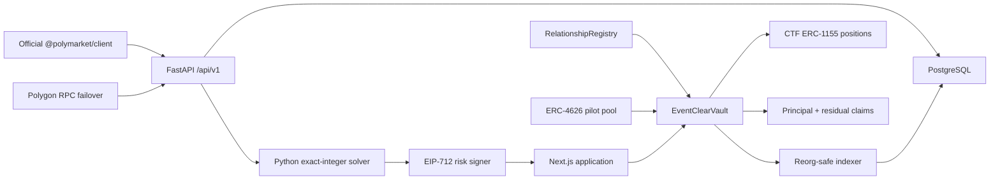

# EventClear

EventClear is an experimental collateral-compression protocol for formally related Polymarket positions. It escrows exact ERC-1155 outcome-token legs, advances pUSD against a deterministically proven minimum terminal payout, and leaves the user with a transferable residual claim.

> **Experimental unaudited MVP. Do not deposit funds you cannot afford to lose.**

No title similarity, language model, frontend calculation, or unregistered rule can authorize capital. Origination requires a reviewed relationship hash, complete settlement semantics, a reproducible solver proof, a fresh EIP-712 risk quote, and exact onchain token escrow.

## Architecture



The same application logic supports `local`, `polygon-fork`, and `polygon-mainnet`. Mainnet mode refuses to start unless every safety gate is explicit and the checked-in contract manifest passes bytecode and interface validation.

## Local setup

Requirements: Docker with Compose, Node 22+, pnpm, Python 3.12, and Foundry.

```bash
cp .env.example .env
make install
make dev
```

Open the application at `http://localhost:3000`, API docs at `http://localhost:8000/docs`, and solver docs at `http://localhost:8001/docs`. The execution-capable seed is restricted to reviewed standard binary crypto-threshold positions.

Useful commands:

```bash
make test
make test-contracts
make test-solver
make test-integration
pnpm test:e2e
make fork-test POLYGON_RPC_URL=https://...
make lint
make typecheck
make seed
make deploy-local
pnpm indexer:run
pnpm indexer:backfill -- --from-block 70000000
pnpm indexer:reconcile
```

## Solver methodology

All amounts are pUSD atomic integers (six decimals). Each approved threshold
definition supplies normalized predicates plus an independently reviewed truth
table. The solver:

1. Checks the exact definition hash/version and every leg’s condition, token, and outcome.
2. Generates every terminal price region from exact integer/rational threshold
   boundaries, including strict versus inclusive comparisons.
3. Applies reviewed exceptional fractional/cancellation states and rejects any
   mismatch with the independent truth table.
4. Computes every leg payout with integer arithmetic in every generated world.
5. Returns minimum and maximum witnesses plus a canonical SHA-256 proof artifact.
6. Reproduces a saved artifact with `eventclear-solver verify proof.json`.

For 100 YES shares above $100K plus 100 NO shares above $150K, the three valid payouts are 100, 200, and 100 pUSD. The proven floor is therefore 100 pUSD. With 80 and 100 shares, the payouts are 100, 180, and 80; the floor is 80.

The solver proves consistency between reviewed predicates, generated worlds and
the reviewed truth table; it does not prove that real-world source rules were
authored correctly. Definition review and rule hashes are therefore capital
controls, not documentation.

## Contracts

- `RelationshipRegistry` stores immutable approved definition hashes, versions, validity windows, and lifecycle status.
- `EventClearVault` verifies EIP-712 quotes, binds legs/amounts, escrows tokens, coordinates funding, redeems resolved positions by balance difference, and allocates principal before residual.
- `EventClearClaims` mints transferable ERC-1155 principal and residual claims with deterministic IDs `(bundleId << 8) | claimType`.
- `EventClearFundingPool` is an allowlisted ERC-4626 pilot pool. `totalAssets =
  liquid pUSD + outstanding gross advance cost basis - outstanding quoted
  fees`; unearned fees and yield are not recognized before settlement. Its
  explicit ledgers separate gross financing return, LP yield, origination and
  protocol fees, borrower refunds, and realized loss.
- `PolymarketStandardAdapter` isolates exact standard-market legs before CTF redemption and wraps the resulting USDC.e into pUSD. Negative-risk originations are disabled for the first pilot.
- `EventClearTreasury` records fee sources and permits multisig-controlled withdrawal.
- Local mocks implement pUSD, CTF positions, resolution, redemption, fractional payouts, and a full bundle lifecycle.

The first vault is intentionally non-upgradeable. Role holders are multisig-ready. Originations can pause independently while settlement remains available.

Origination fees are realized only from settlement yield: principal repays the
pool's gross advance cost basis, the quoted fee is transferred to the treasury
only up to available financing return, and any unearned portion is refunded to
the borrower. The protocol yield fee applies only to additional return.
Break-even and shortfall bundles pay no protocol fee.

## Relationship definitions

Approved definitions are immutable and deterministically serialized. Corrections create a new version. Crypto thresholds require exact agreement on asset, quote currency, observation type/time, time zone, expiry, price and resolution sources, spike/outage/unavailable-data behavior, and cancellation semantics. Election and sports relationships are always review-gated. Arbitrary reviewed relationships use explicit valid-world payout tables.

Only the canonical definition and rule-document hashes are stored onchain; full documents and reviews remain in the append-only database history.

## API examples

```bash
curl http://localhost:8000/api/v1/markets
curl http://localhost:8000/api/v1/markets/CONDITION_ID/snapshots
curl "http://localhost:8000/api/v1/tokens/TOKEN_ID/history?interval=1d&fidelity=60"
curl http://localhost:8000/api/v1/wallets/0x0000000000000000000000000000000000000001/eligible-bundles
curl http://localhost:8000/api/v1/relationships
curl http://localhost:8000/api/v1/pool
```

`POST /api/v1/bundles/analyze` accepts the solver request schema. `POST /api/v1/quotes` reruns the solver and returns a wallet/chain/vault/nonce-bound EIP-712 quote. Administrative endpoints require `X-Admin-Token` locally and record audit events.

## Polymarket integration

The TypeScript gateway uses the current unified `@polymarket/client` for typed market discovery and realtime subscriptions. It reconnects with capped exponential backoff, marks disconnect events stale, and discards out-of-order local timestamps. The API validates live public CLOB orderbooks and price history, stores book snapshots durably, and refuses execution when neither CLOB nor a cache observation inside `MARKET_FRESHNESS_SECONDS` is available. Exchange mutation timestamps are retained as source-lag telemetry and are not confused with HTTP observation freshness. Viem handles EVM reads and manifest verification. The checked-in Polygon registry is sourced only from the official Polymarket contract page and includes current pUSD/CTF/adapters/exchanges/UMA/PositionManager/combo modules.

No user private key is requested or stored. The first execution path supports
only EOAs where SIWE signer, borrower, position wallet and transaction sender
are identical. Deposit Wallet, Safe, Proxy and other smart-wallet paths remain
read-only until their controlling-signer relationship is independently
verified and tested.

## Complete lifecycle

Connect a wallet → resolve the position-holding account → index exact positions → discover rule-compatible candidates → select a registered definition → reproduce all terminal worlds → request a fresh quote → approve only the vault operator → escrow exact legs → receive pUSD → hold residual claim → wait for every condition’s final payout → permissionlessly redeem positions → allocate principal then residual → burn claims on partial or full redemption.

A bundle below principal becomes `SHORTFALL`; all proceeds go to principal and the pool never silently fills the gap with unrelated assets.

## Deployment

The public production-readonly web is deployed through Sites. The selected
external staging architecture is AWS ECS/Fargate with RDS PostgreSQL,
ElastiCache Redis, private versioned S3 artifact storage, KMS signing,
Secrets Manager and CloudWatch. See `docs/AWS_STAGING_SETUP.md`. No AWS staging
resource is currently provisioned. Use separate secrets and databases for
`development`, `test`, `staging`, `production-readonly`, and
`production-mainnet`.

Production API processes must set `EVENTCLEAR_STORE=postgres`. Authentication
nonces and session tokens are stored only as SHA-256 digests, quote nonces are
allocated atomically, and API read models survive process restarts. Apply
`infrastructure/docker/postgres/migrations/001_initial.sql` followed by
`002_operational_state.sql` before starting the API against an existing
database. Demo market data is never seeded in `polygon-mainnet` mode.

Production-mainnet requires:

```text
ENABLE_MAINNET_EXECUTION=true
PRODUCTION_MANIFEST_APPROVED=true
RISK_SIGNER_CONFIGURED=true
ADMIN_MULTISIG_CONFIGURED=true
RPC_FAILOVER_CONFIGURED=true
EVENTCLEAR_MODE=polygon-mainnet
EVENTCLEAR_STORE=postgres
CHAIN_ID=137
RISK_SIGNER_BACKEND=kms
```

Provide multiple `POLYGON_RPC_URLS`, remote signer/KMS configuration, SIWE session secret, admin multisig addresses, database/Redis credentials, Sentry DSN, and deployed EventClear addresses. Never deploy from a browser-controlled flag. Deploy contracts through a hardware-wallet/multisig review workflow and compare bytecode, constructor arguments, and role assignments before verification.

## Mainnet activation checklist

- Independent professional contract and protocol audit completed.
- Official Polymarket registry re-reviewed; `scripts/verify-manifest.ts` passes against two RPC providers.
- Adapter ABIs and redemption calls verified on a pinned Polygon fork.
- Risk signer uses KMS/HSM, rotation is tested, and no raw key exists in application secrets.
- Admin, reviewer, suspender, pauser, and treasury roles are assigned to reviewed multisigs.
- Exposure caps, utilization, reserve, quote lifetime, freshness, and time-to-resolution limits approved.
- Reorg/backfill/reconciliation and RPC inconsistency drills pass.
- Incident response, monitoring alerts, legal review, and pilot allowlist are live.
- Frontend build hash and contract address manifest are independently checked.
- Mainnet execution flags are enabled only after all prior gates pass.

## Security and limitations

Read [THREAT_MODEL.md](THREAT_MODEL.md), [SECURITY.md](SECURITY.md), and [DECISIONS.md](DECISIONS.md). Builds run TypeScript, Python, Solidity, fuzz/invariant, Slither, Docker, dependency, secret, and optional fork checks.

Known MVP limitations:

- Relationship correctness depends on reviewed source rules.
- The solver proves a supplied formal model, not the real world.
- Mainnet contracts require an independent professional audit.
- Resolution delays create duration and liquidity risk.
- Independent cancellation or unusual resolution can affect guarantees.
- The first release supports a controlled relationship-template set.
- Public permissionless LP deposits must remain disabled pending legal and security review.
- The web preview uses seeded local figures; production value always comes from fresh backend and onchain reads.
